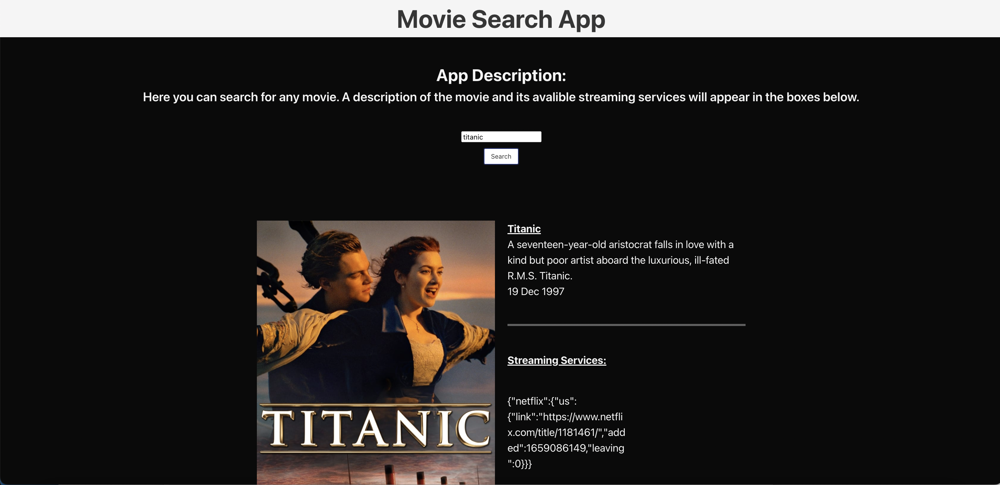

# Movie Searcher 

This interactive application allows the user to search for any movie tile and get the movie details; year of release, summary of the plot, and poster. It also shows the different streaming platforms where the movie is available to watch, as well as a link to access it. 

This applications uses the OMD and OTT APIs to fetch and display the data. 

## User Story

As a user when searching for a movie title, I get the details and description of the movie, as well as the platforms in which it’s available for streaming. 

## Screenshot

The following screenshot shows the web application's appearance and functionality:

## Deployed Link 

The application can be found at the following link:

[Deployed-link] (https://annguyentran.github.io/Movie-Searcher-/)

